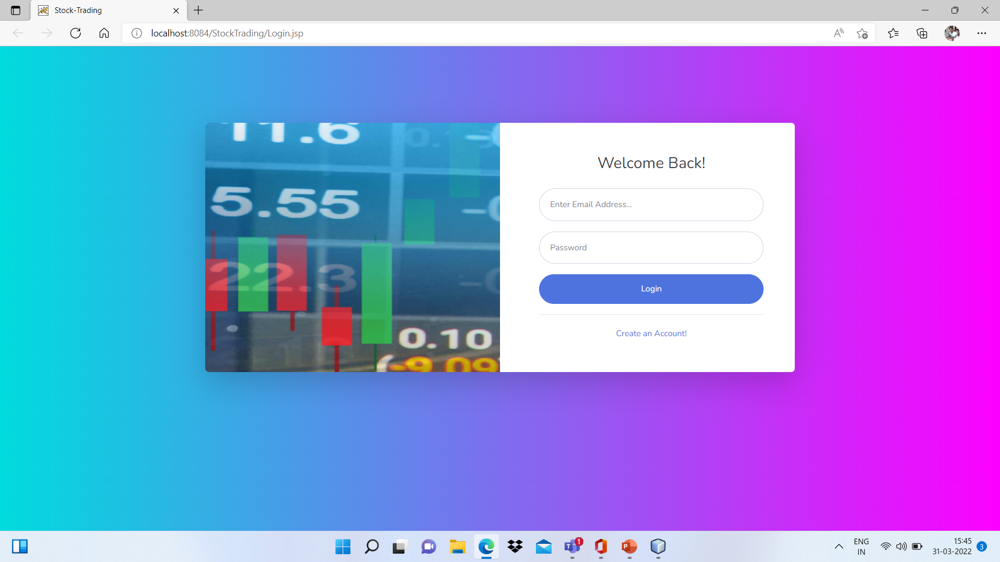

# Stock-Trading
Created a Stock Trading webapp Using HTML CSS Js and JSP and Servlet

The main code is under web folder.

Some Screenshots of the App UI

**1) Login UI**

**2) Registration UI**

**3) Home if user don't have any stock**

**4) Home if user have some holdings**

**5) Searched Stock All real time data fetched using API**

**6) Buy Stock**

**7) Sell Stock (dropdown contain only those stocks user brought or have in thier potfolio)**

